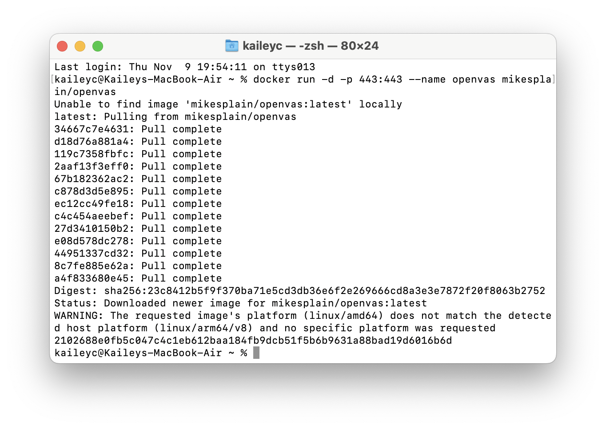
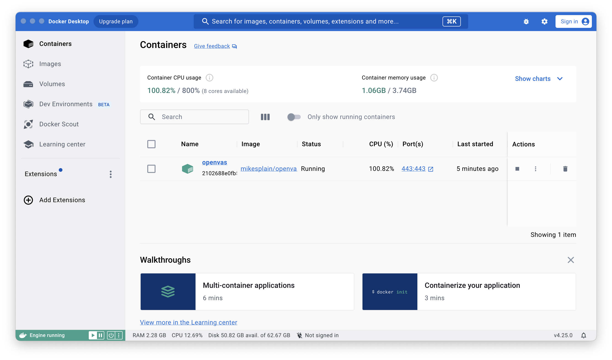
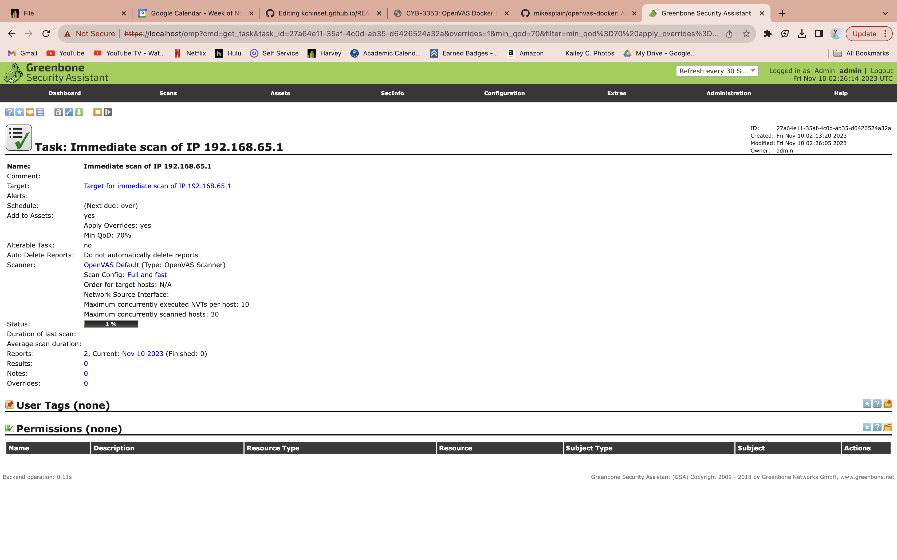

# Project 1: Arch Linux VM Installation

Project for CYB 3353-System Administration at The Univeristy of Tulsa.

Kailey Chinsethagid

Prof. Codi West

## Part 1: Get ISO and verify signature

Download ISO file from trusted source. I got mine from mit.edu.

Generate sha256 checksum of file using the command `Get-FilePath 'filepath'` in Windows Powershell.

- Compare result to verified checksum on the Arch Linux wiki.

## Part 2: Create Virtual Machine

Using VMware Workstation 17

- Create new virtual machine using ISO download.
- Select `Other Linux 5.x kernel 64-bit` as the operating system.
- Allocate 20 GB to disk size and change memory to 2048 MB.
- Open the associated .vmx file and write `firmware="efi"` on the second line of the file.

Ensure SVM is enabled in system BIOS in order to run VM.

## Part 3: Installation

Verify boot mode: `# cat /sys/firmware/efi/fw_platform_size`

- The command should return `64` to confirm the system has booted in UEFI mode.

Ensure network interface is enabled: `ip link`

- Verify connection using `ping`

Check system clock for accuracy: `timedatectl`

Partition disks: `fdisk /dev/sda`

- Use command `n` to create primary partition with +500M.
- Create another primary partition with the remainder of the disk space.
- Save partitions using command `w`.

Format partitions

- Format EFI partition: `mkfs.fat -F 32 /dev/sda1`
- Format root partition: `mkfs.ext4 /dev/sda2`

Mount filesystems

- EFI partition: ` mount --mkdir /dev/sda1 /mnt/boot`
- Root partition: ` mount /dev/sda2 /mnt`

Install essential packages: `pacstrap -K /mnt base linux linux-firmware $(pacman -Qqe) dhcpcd`


## Part 4: Configuration

Generate an fstab file: `genfstab -U /mnt >> /mnt/etc/fstab`

Change root into the new system: `arch-chroot /mnt`

Set the time zone: `ln -sf /usr/share/zoneinfo/America/Chicago /etc/localtime`

- Run hwclock to generate /etc/adjtime: `hwclock --systohc`

Generate the locales: `locale-gen`

- Create the locale.conf file and set the LANG variable: `echo LANG=en_US.UTF-8 >> /etc/locale.conf`

Create the hostname file: `echo kaileyarch >> /etc/hostname`

Set the root password: `passwd`

Configure GRUB:

- `pacman -S grub`
- `mkdir /boot/EFI`
- `mount /dev/sda1 /boot/EFI`
- `grub-install --target=x86_64-efi --bootloader-id=grub_uefi --recheck --efi-directory=/boot/EFI`
- `cp /usr/share/locale/en\@quot/LC_MESSAGES/grub.mo /boot/grub/locale/en.mo`
- `grub-mkconfig -o /boot/grub/grub.cfg`

Exit chroot environtment: `exit`

Reboot: `reboot`

In VM settings, set network connection to "bridged".

- After reboot: `systemctl restart systemd-resolved` and `systemctl start dhcpcd.service`

## Part 5: Customization

Install GNOME desktop environment: `pacman -S gnome gnome-extra`

- `systemctl enable gdm.service` and reboot

Create user accounts:

- `useradd -m "username"`
- To require password change at next login: `passwd -e "username"`
- To give sudo permissions: `visudo` and edit file for each user: `"username"=ALL(ALL:ALL) ALL`

Install zsh: `pacman -S zsh`

- To set as default shell: `chsh -s /usr/bin/zsh`

Install SSH: `pacman -S openssh`

Install Oh My Zsh: `sh -c "$(curl -fsSL https://raw.githubusercontent.com/robbyrussell/oh-my-zsh/master/tools/install.sh)"`

Install net-tools: `sudo pacman -Sy net-tools`


# Project 2: Docker

## Part 1: Install Docker

Downlaod Docker for Mac: https://docs.docker.com/desktop/install/mac-install/

Launch Docker application and agree to terms of service.

In a terminal, type `docker compose version` to check that the Docker Compose Plugin is installed.

## Part 2: Install OpenVAS

In a terminal, run `docker run -d -p 443:443 --name openvas mikesplain/openvas` to install the container.



The conainer should now appear in Docker.



## Part 3: Run a Vulnerability Scan

Navigate to https://localhost

Login with username and password `admin`

Click Scans -> Tasks -> Quick Start

Leave default IP and start scan.



## Part 4: docker-compose.yml

Following the instructions provided at https://supahnerdy.github.io/openVAS.html

`mkdir ~/docker-build`

`cd ~/docker-build`

`nano docker-compose.yml`

```
version: '3'
services:
  nginx:
      image: nginx:alpine
      restart: always
      hostname: nginx
      ports:
        - "80:80"
      links:
        - openvas
      volumes:
        - ./conf/nginx.conf:/etc/nginx/nginx.conf:ro
  nginx_ssl:
      image: nginx:alpine
      restart: always
      hostname: nginx_ssl
      ports:
        # CHANGE for ports
        - "443:443"
      links:
        - openvas
      volumes:
        - ./conf/nginx_ssl.conf:/etc/nginx/nginx.conf:ro
  openvas:
      restart: always
      image: mikesplain/openvas
      hostname: openvas
      expose:
        - "443"
      volumes:
        - "./data/openvas:/var/lib/openvas/mgr/"
      environment:
        # CHANGE for psswd:
        OV_PASSWORD: password123
      labels:
         deck-chores.dump.command: sh -c "greenbone-nvt-sync; openvasmd --rebuild --progress"
         deck-chores.dump.interval: daily
```

`docker-compose up -d`
