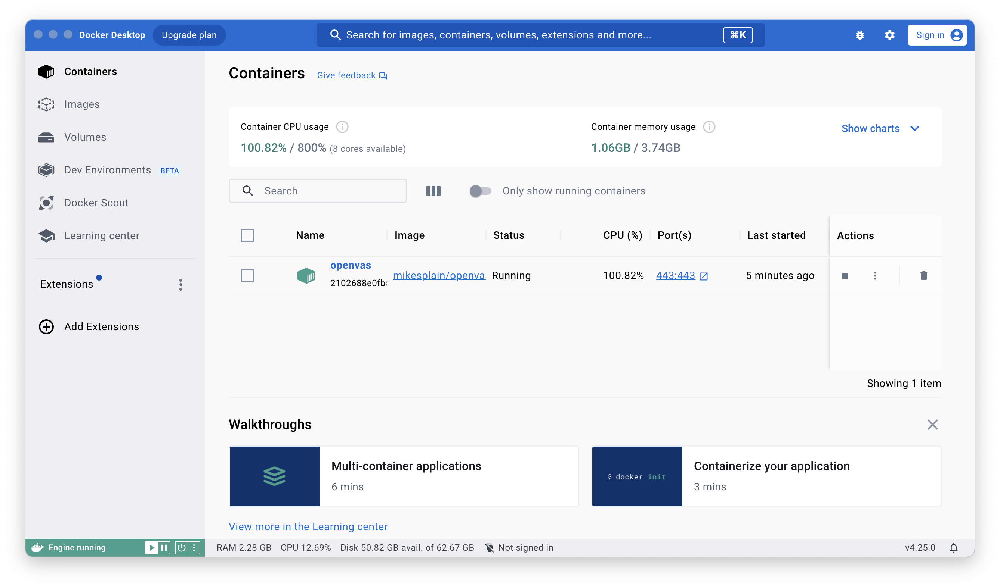
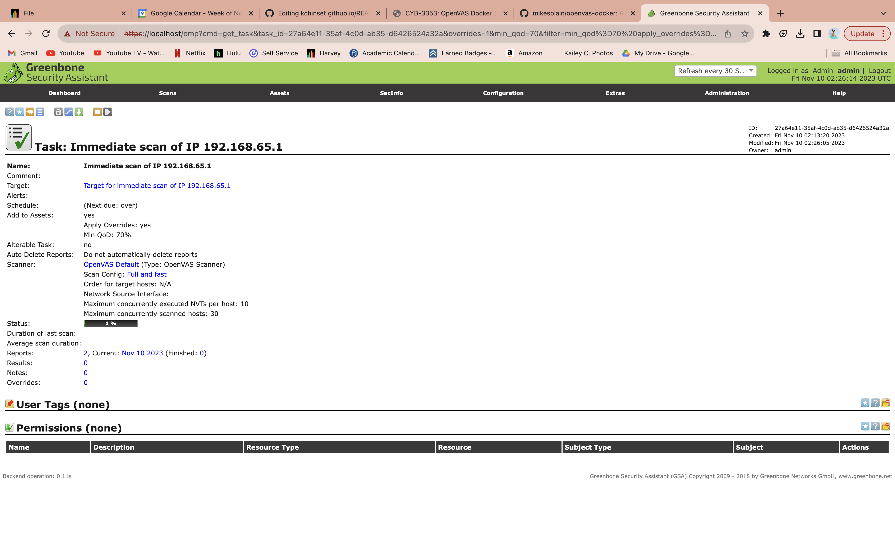

# Project 2: Docker

## Part 1: Install Docker

Downlaod Docker for Mac: https://docs.docker.com/desktop/install/mac-install/

Launch Docker application and agree to terms of service.

In a terminal, type `docker compose version` to check that the Docker Compose Plugin is installed.

## Part 2: Install OpenVAS

In a terminal, run `docker run -d -p 443:443 --name openvas mikesplain/openvas` to install the container.


The conainer should now appear in Docker.



## Part 3: Run a Vulnerability Scan

Navigate to https://localhost

Login with username and password `admin`

Click Scans -> Tasks -> Quick Start

Leave default IP and start scan.



## Part 4: docker-compose.yml

Following the instructions provided at https://supahnerdy.github.io/openVAS.html

`mkdir ~/docker-build`

`cd ~/docker-build`

`nano docker-compose.yml`

```
version: '3'
services:
  nginx:
      image: nginx:alpine
      restart: always
      hostname: nginx
      ports:
        - "80:80"
      links:
        - openvas
      volumes:
        - ./conf/nginx.conf:/etc/nginx/nginx.conf:ro
  nginx_ssl:
      image: nginx:alpine
      restart: always
      hostname: nginx_ssl
      ports:
        # CHANGE for ports
        - "443:443"
      links:
        - openvas
      volumes:
        - ./conf/nginx_ssl.conf:/etc/nginx/nginx.conf:ro
  openvas:
      restart: always
      image: mikesplain/openvas
      hostname: openvas
      expose:
        - "443"
      volumes:
        - "./data/openvas:/var/lib/openvas/mgr/"
      environment:
        # CHANGE for psswd:
        OV_PASSWORD: password123
      labels:
         deck-chores.dump.command: sh -c "greenbone-nvt-sync; openvasmd --rebuild --progress"
         deck-chores.dump.interval: daily
```

`docker-compose up -d`
