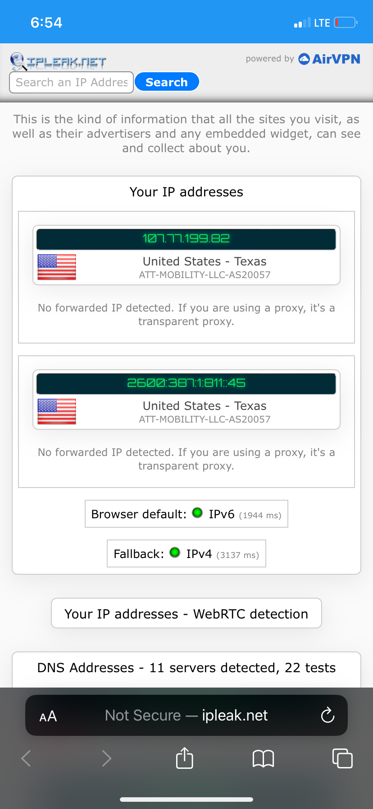
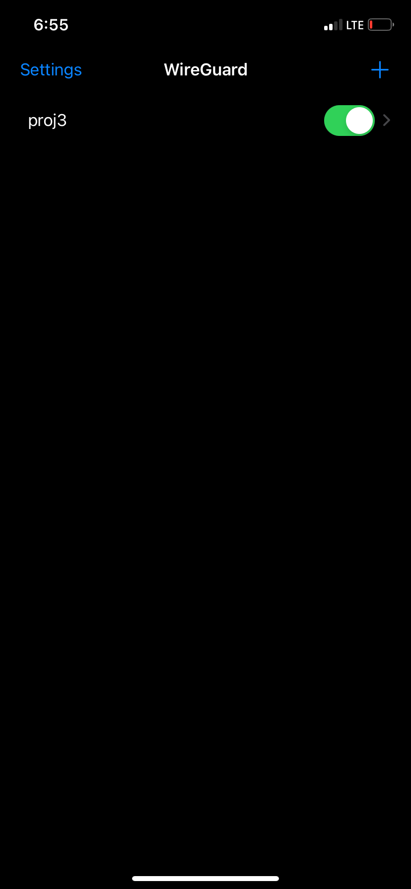
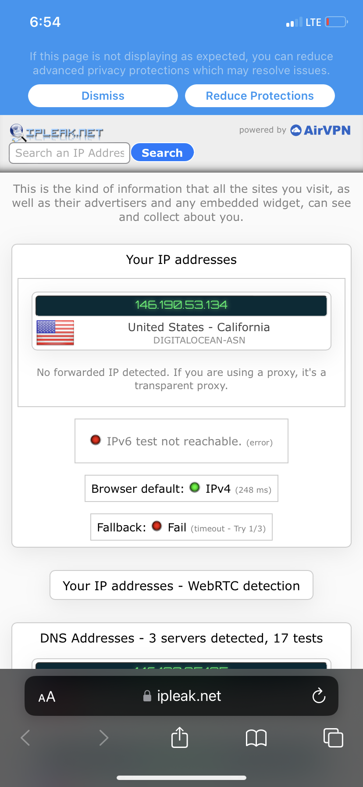
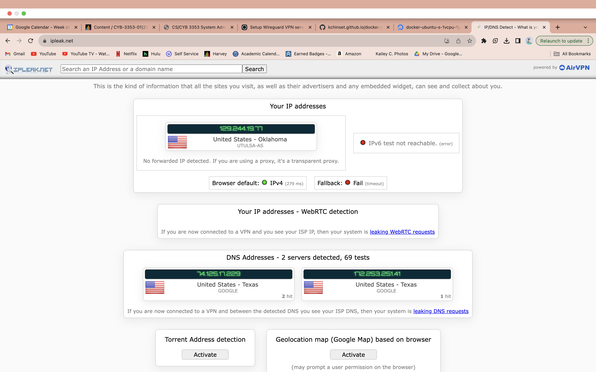
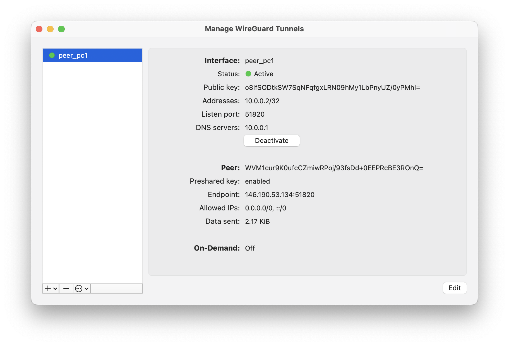
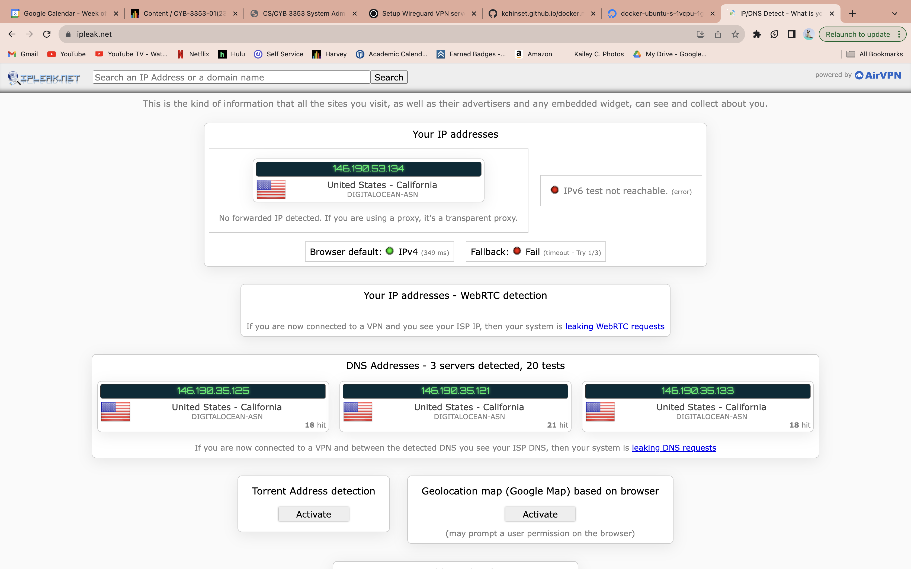

# Project 3: Wireguard

## Part 1: Create an Ubuntu Droplet

Using digitalocean.com:

- Select Deploy Virtual Machine
- Leave default region and datacenter selection
- Select the image Docker 23.0.6 on Ubuntu 22.04
- Select Basic plan and Regular CPU at $6/month
- Add SSH key for authentication

## Part 2: Install Wireguard

To update docker: `apt update docker-compose`

Install Wireguard:
- `mkdir -p ~/wireguard/`
- `mkdir -p ~/wireguard/config/`
- `nano ~/wireguard/docker-compose.yml`
- Copy and paste:
```
version: '3.8'
services:
  wireguard:
    container_name: wireguard
    image: linuxserver/wireguard
    environment:
      - PUID=1000
      - PGID=1000
      - TZ=America/Chicago
      - SERVERURL=146.190.53.134
      - SERVERPORT=51820
      - PEERS=pc1,pc2,phone1
      - PEERDNS=auto
      - INTERNAL_SUBNET=10.0.0.0
    ports:
      - 51820:51820/udp
    volumes:
      - type: bind
        source: ./config/
        target: /config/
      - type: bind
        source: /lib/modules
        target: /lib/modules
    restart: always
    cap_add:
      - NET_ADMIN
      - SYS_MODULE
    sysctls:
      - net.ipv4.conf.all.src_valid_mark=1
```
- Start Wireguard:
```
cd ~/wireguard/
docker-compose up -d
```

## Part 3: Connect phone to Wireguard

- To generate QR code: `docker-compose logs -f wireguard`
- Go into Wireguard app on phone and create new tunnel from QR code







## Part 4: Connect laptop to Wireguard

- To copy config files from remote machine to local machine: `scp root@146.190.53.134:/root/wireguard/config /Users/kaileyc/Documents/`
- Open wireguard app on laptop and create new tunnel from file, selecting the appropriate peer.






